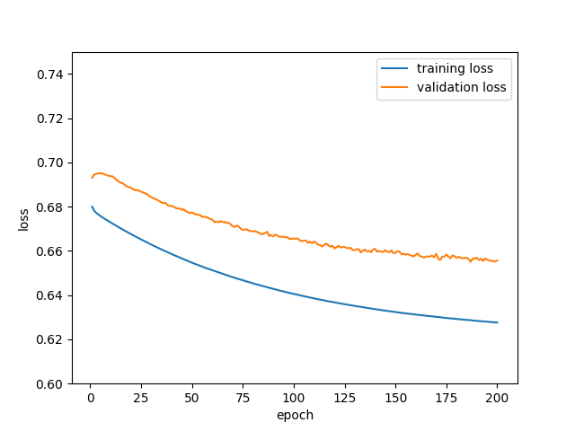
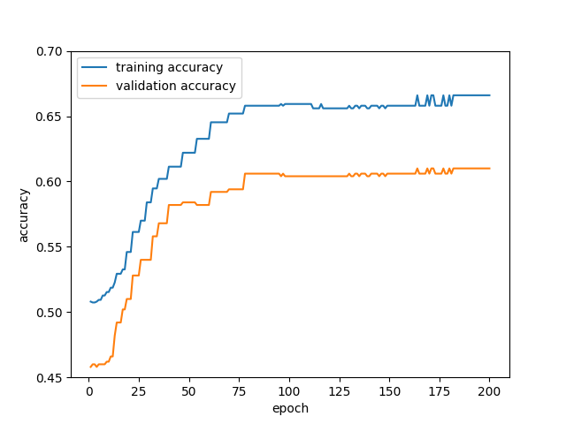

# Preferred Networks Intern Screening 2019 Coding Task for Machine Learning / Mathematics Fields

Preferred Networks Intern Screening 2019 Coding Task for Machine Learning / Mathematics Fields by Ryo Kamoi (鴨井 遼).
(I didn't get hired)

## Environment
 * Python 3.6.2
 * Required libraries are listed in "pip.freeze". All libraries can be installed by the following script.

```bash
pip install -r pip.freeze
```

 * The codes are tested on OS X (10.14.4)

## How to Run
The codes should be executed in directory "src".

```bash
cd src
```

The main script of this project is "main.py", which provides training of binary classifier with
Graph neural network (GNN).
 "main.py" requires a configuration file.

```bash
pyhon main.py config_file
```

A detailed explanation of configuration file is mentioned later.
Some example configuration files are provided in "config" directly.
The training with simple SGD can be executed as follows.

```bash
python main.py config/sgd.txt
```

The directory "datasets" should be placed at the root directly if you run with example configuration files.
You can specify the dataset directory by changing value for "train_data_directory" in the configuration file.

### Problem 1
The problem 1 is implemented as a test code for "model/gnn_graph_feature.py".

```bash
python test/test_gnn_graph_feature.py
```

### Problem 2
The problem 2 is implemented as a test code for "model/gnn_binary_classifier.py".
```bash
python test/test_gnn_binary_classifier.py
```

### Problem 3
The problem 3 is implemented as "main.py".
The optimization methods can be switched by changing the option "optimizer" 
in the configuration file.

 * SGD
```bash
python main.py config/sgd.txt
```

 * Momentum SGD
```bash
python main.py config/momentum_sgd.txt
```

### Problem 4
 * Adam
 
The Adam optimizer is implemented as an option of optimizer.
```bash
python main.py config/adam.txt
```

 * Activation Function

I compare different activation functions tanh (compared in Duvenaud, 2015)
and sigmoid function.
The activation function for aggregation can be specified in
the configuration file by changing the option "activation_for_graph_feature".

```bash
python main.py config/adam_tanh.txt
```

 * Super-Node

The super-node (the new node connected with all other nodes)
can be added by setting "super_node=True" in the configuration file.

```bash
python main.py config/adam_sn.txt
```

 * Multiple layers for graph aggregation
 
The number of layers and the size of hidden units can be specified
by changing "layers" in the configuration file.
In this implementation, both the input size and output size are feature_dim.

```text
layers=[input_size, hidden unit size 1, ... ,hidden unit size n, output_size]
```

```bash
python main.py config/adam_2layers.txt
```

### Test Codes
You can run all test codes from "src/test.sh".
```bash
sh test.sh
```

The content of "src/test.sh" is as follows.
```bash
python test_gnn_graph_feature.py
python test_gnn_binary_classifier.py
```

### Prediction
The prediction for test data can be performed with "prediction.py".
The configuration file for model, the directory of dataset,
and the output file should be specified.

```bash
python prediction.py config_file ../datasets/test ../prediction.txt
```

The result saved in "prediction.txt" is the prediction result
by the best classifier in our experiments,
which is the classifier trained with Adam optimizer, and 
tanh is used as the activation function for aggregation.
The same result can be generated by the following script.

```bash
python prediction.py output/adam_tanh/config.txt ../datasets/test ../prediction.txt
```


### Visualization
You can draw a graph of accuracy and loss by using "visualize.py"

```bash
python visualize.py result_file
```

For example, loss and accuracy of Adam are visualized as follows.

```bash
python visualize.py output/adam/result.txt
```





### Configuration File
An example of the configuration file is as follows (config/sgd.txt).
The name of parameters and the value should be connected by equal "=".
The parameters will be stored in the class "Params".

```text
optimizer=sgd
aggregation_num=2
feature_dim=8
learning_rate=0.0001
initialization_std=0.4
derivative_epsilon=0.001
num_of_epochs=50
batch_size=5
activation_for_graph_feature=relu
train_data_directory=datasets/train
```

## Results
The sample results are stored in directory "src/output".
The default settings are as follows.

|                                            | Default Value |
|--------------------------------------------|---------------|
| Number of steps in aggregation             | 2             |
| Dimension of feature vectors               | 8             |
| Learning rate                              | 0.0001        |
| Perturbation for numerical differentiation | 0.001         |
| Number of epochs                           | 200           |

Parameter W and A are initialized by gaussian distribution with mean   and standard deviation       .
Parameter b is initialized to zero.

The directories in "src/output" are results with different settings as follows.

| directory name | settings                                                         |
|----------------|------------------------------------------------------------------|
| sgd            | SGD optimizer                                                    |
| momentum_sgd   | Momentum SGD optimizer                                           |
| adam           | Adam optimizer                                                   |
| adam_tanh      | Using tanh as an activation function for aggregation             |
| adam_sigmoid   | Using sigmoid function as an activation function for aggregation |
| adam_mlp       | Using 2 layer MLP for aggregation                                |
| adam_supernode | Using super-node                                                 |

## Author
Ryo Kamoi (ryokamoi.jp@gmail.com)
